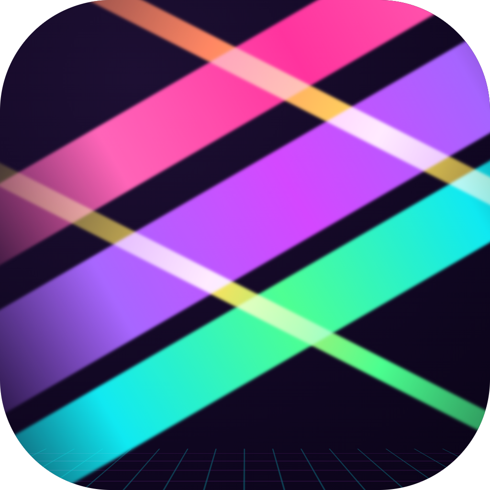
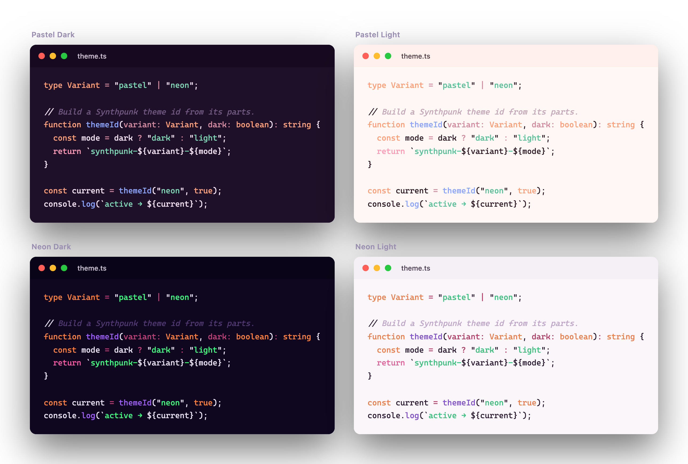
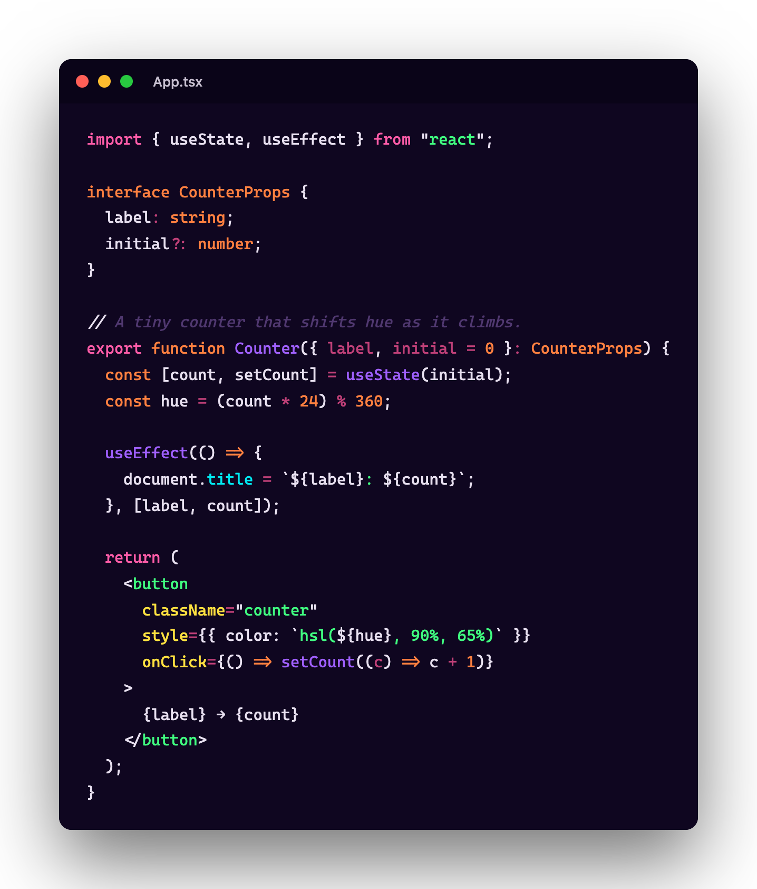
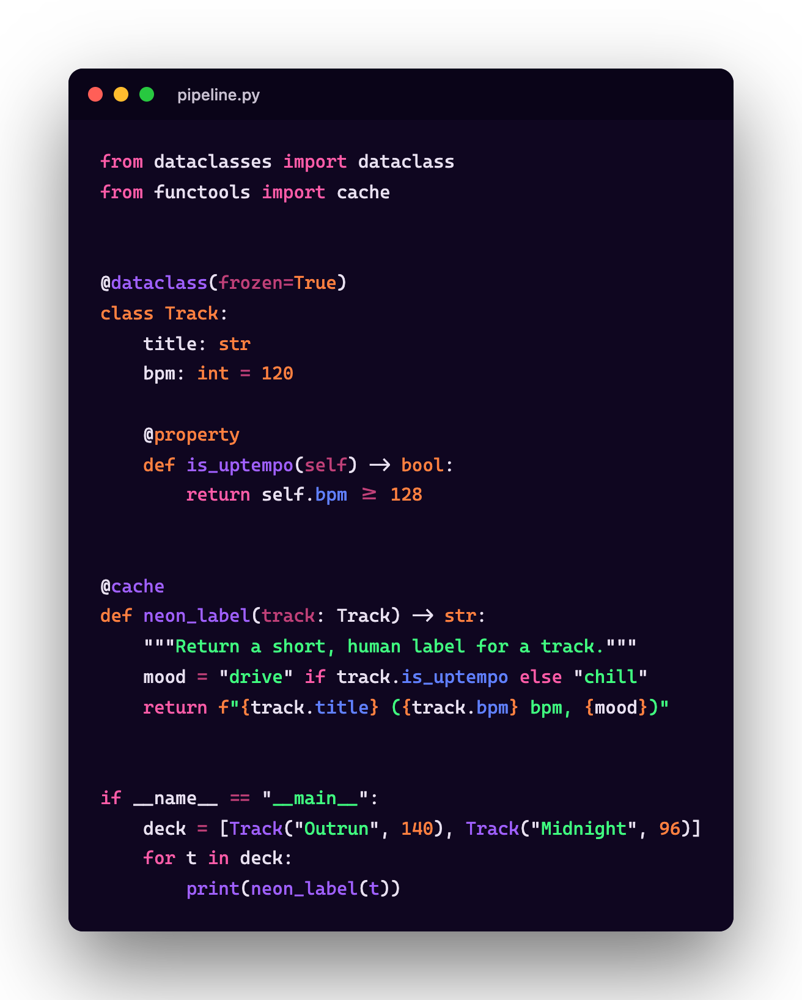
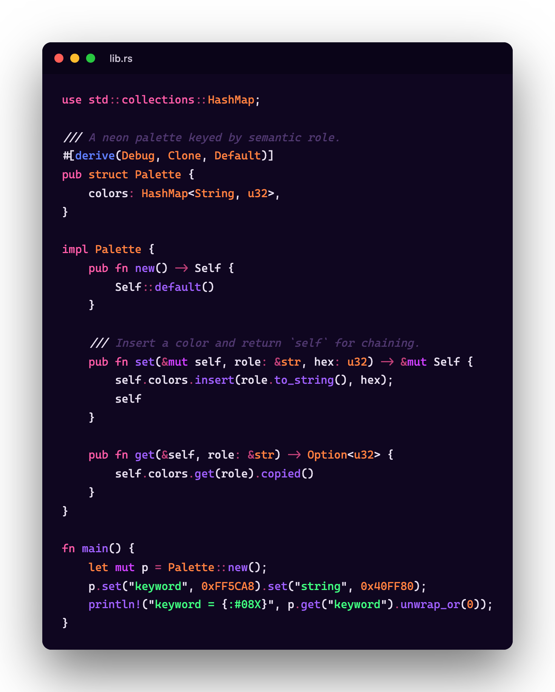
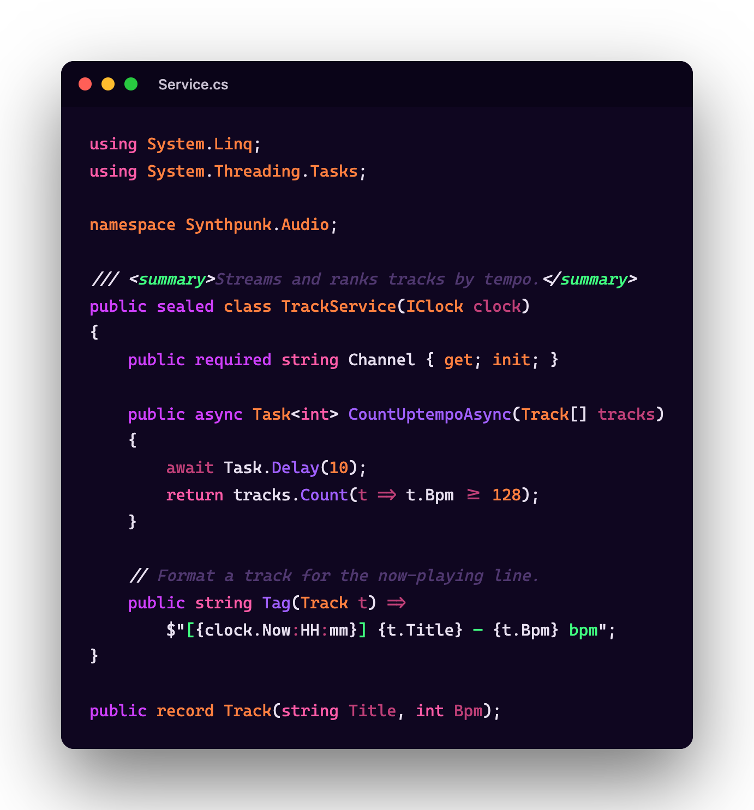
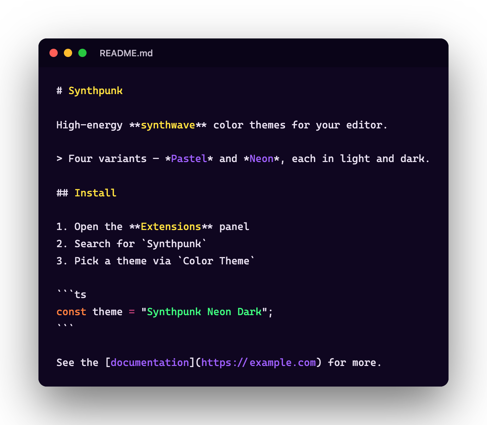

<p align="center">
  
</p>

# Synthpunk

High-energy synthwave-inspired color themes for VS Code, Zed, Neovim, WezTerm, and Starship. Four variants: Pastel Dark/Light and Neon Dark/Light.



## Preview

Syntax highlighting shown in the **Neon Dark** variant:

### React



### Python



### Rust



### C#



### Markdown



Full palette swatches for every variant: [Pastel Dark](assets/palette-preview-dark.png) · [Pastel Light](assets/palette-preview-light.png) · [Neon Dark](assets/palette-preview-neon-dark.png) · [Neon Light](assets/palette-preview-neon-light.png). Preview images are generated by [`assets/generate/`](assets/generate/).

## Installation

### VS Code

Install from the [VS Code Marketplace](https://marketplace.visualstudio.com/items?itemName=synthpunk.synthpunk) (search "Synthpunk"), then select your theme via `Preferences: Color Theme`.

For local development, see [`themes/vscode/README.md`](themes/vscode/README.md).

### Zed

Install from the Zed extension registry (search "Synthpunk"), then select your theme from the theme picker.

For local development, see [`themes/zed/README.md`](themes/zed/README.md).

### Neovim

Install via [Lazy.nvim](https://github.com/folke/lazy.nvim):

```lua
return {
  "slowdini/synthpunk.nvim",
  lazy = false,
  priority = 1000,
  config = function()
    vim.cmd("colorscheme synthpunk-pastel-dark")
  end,
}
```

See [`themes/neovim/README.md`](themes/neovim/README.md) for manual installation and variant details.

### WezTerm

```sh
curl -fsSL https://github.com/slowdini/synthpunk/releases/latest/download/synthpunk-pastel-dark.toml -o ~/.config/wezterm/colors/synthpunk-pastel-dark.toml
```

Then set `config.color_scheme = 'Synthpunk Pastel Dark'` in your `wezterm.lua`. See [`themes/wezterm/README.md`](themes/wezterm/README.md) for all variants.

### Starship

```sh
curl -fsSL https://github.com/slowdini/synthpunk/releases/latest/download/starship.toml -o ~/.config/starship.toml
```

The default variant is `synthpunk_pastel_dark`. To switch, change the `palette =` line to `synthpunk_pastel_light`, `synthpunk_neon_dark`, or `synthpunk_neon_light`. See [`themes/starship/README.md`](themes/starship/README.md) for details.

## Development

```sh
bun install          # install dependencies
bun run build        # regenerate all theme artifacts from palette/
bun test             # run tests
bun run check        # lint + typecheck
bun run format       # auto-format
```

All theme files under `themes/` are generated from `palette/` by the generator. Never edit them directly — edit `palette/` and `generator/`, then run `bun run build`.

## Releasing

Releases are cut from `dev` and tagged from `main`:

1. Merge feature PRs into `dev` after CI passes.
2. When ready to ship, trigger the **Release PR** workflow with the next version number. It bumps every manifest via `scripts/bump-version.ts`, commits to `dev`, and opens a `dev → main` PR.
3. Review the release PR and merge.
4. Merging to `main` automatically tags `vX.Y.Z`, creates the GitHub release, uploads the Starship and WezTerm config files as release assets, builds the VS Code VSIX, and fans out publish jobs (VS Code Marketplace, OpenVSX, Zed, synthpunk.nvim) — each gated on a configured secret.
5. After a release, merge `main` back into `dev` to keep them in sync.

See [`RELEASE.md`](RELEASE.md) for manual publishing steps and prerequisite setup.

## License

MIT
